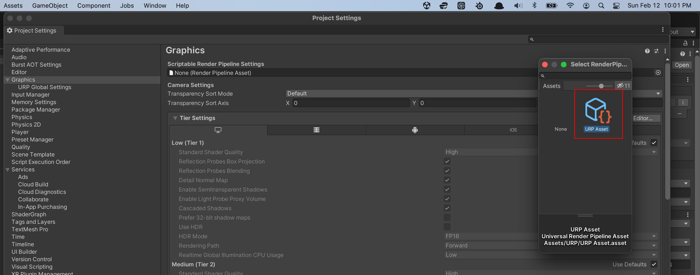
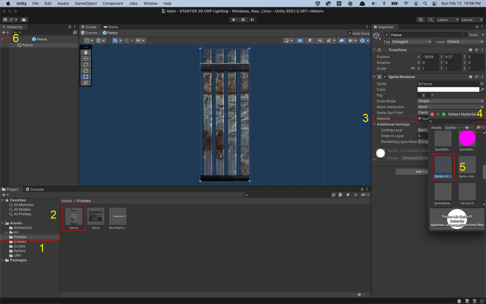

# Unity : Getting Started with 2D URP Lighting

**Table of Contents**

- [Overview](#overview)
- [Prerequisites](#Prerequisites)
- [Installation](#Installation)
- [Lesson Steps](#lesson-steps)
  - [TODO 1 : Install the Universal Render Pipeline Package](#todo-1--install-the-universal-render-pipeline-package)
  - [TODO 2 : Create and Install the Required URP Asset](#todo-2--create-and-install-the-required-URP-asset)
  - [TODO 3 : Add a Global Light 2D to our Scene](#todo-3--add-a-global-light-2D-to-our-scene)
  - [TODO 4 : Adjust the Global Light](#todo-4--adjust-the-global-light)
  - [TODO 5 : Swap Materials](#todo-5--swap-materials)
  - [TODO 6 : Edit Prefabs](#todo-6--edit-prefabs)
  - [TODO 7 : Adjust the Global Light Again](#todo-7--adjust-the-global-light-again)
  - [TODO 8 : Add a Spot Light 2D to our Player](#todo-8--add-a-spot-light-2D-to-our-player)
  - [TODO 9 : Adjust the Player Spot Light](#todo-9--adjust-the-player-spot-light)

## Overview

In Unity, a `package` is a library of code and or assets that provide some additional functionality or features, such as advanced math or physics. Some packages come pre-installed with any Unity project you create. However, we can install additional packages into our projects to add functionality, like lighting!

We are going to install the <a href="https://unity.com/srp/universal-render-pipeline" target="_blank">Universal Render Pipeline (URP)</a> package into our starter project. The UPR package will allow us to add and adjust some 2D lights to our Scene, and with these lights, create very dramatic effects.

For more information on the subject, <a href="https://docs.unity3d.com/Packages/com.unity.render-pipelines.universal@14.0/manual/urp-concepts.html" target="_blank">check out the Unity docs on URP, here...</a>

Some concepts you'll practice and learn:

- Using the Unity Package Manager.
- Editing your Unity Project Settings.
- Creating a Render Pipeline Scriptable Asset (sounds scary, but it's not).
- Creating and ordering Sorting Layers and using the Sorting Group component.
- Adding and adjusting a Global Light 2D.
- Adding and adjusting a Spot Light 2D.
- How to affect sorting layers with lighting.

---

### Prerequisites

To start this project, you should have a basic knowledge of the Unity Editor and C# scripting for Unity.

<a href="https://unity.com/download" target="_blank">Install Unity Hub</a> and the Unity Editor at version 2021.3.18f1 or later.

---

### Installation

On the <a href="https://github.com/OperationSpark/unity-2D-URP-lighting" target="_blank">GitHub repository for this project</a>, find the green "<> Code" button:

Click the green "<> Code" button, and either:

- Copy the URL to clone the repository using git, after which you can run the command:

  `git clone git@github.com:OperationSpark/unity-2D-URP-lighting.git`

  ...then within Unity Hub, on the Projects tab, click Open, and in the file navigation dialog box that pops up, navigate to the directory for the project, and click the blue Open button.

- Or, download the the zip, unzip it somewhere on your computer, then within Unity Hub, on the Projects tab, click Open, and in the file navigation dialog box that pops up, navigate to the directory for the project (where you unzipped the download), and click the blue Open button.

If Unity complains that the project you're trying to open is at a different version than the Unity Editor you're using (with which your trying to open this project), just make sure that the Unity Editor you're using is at least later (higher in version number) than the project's version, which is 2021.3.18f1. If it is, just click through to continue to convert the project to the later version of the Unity Editor - this should cause no problems.

---

### Review the Hierarchy

Once our Unity starter project opens up, let's take note of a few things, starting with the assets already in our Hierarchy:

We have a `Player` Game Object, and if you click on the `Player` in the Hierarchy, you'll notice in the Inspector window, the `Player` has our Hallebot walking animation already attached, as well as the necessary components of a Rigidbody2D and a few 2D Colliders. The Hallebot Player is already setup to walk back and forth on the Platform below her feet.

And, we've set up a Cinemachine camera to follow our Player as she walks back and forth.

Next, take note of the `Layers` Game Object, which contains 4 sub layers:

1. Horizon
2. Background
3. Platform
4. Foreground

Each of these layers contains some Prefab assets, a purple Square Sprite in the Horizon layer, some rusty fencing in the Background layer, a platform in the Platform layer, and some wall panels in the Foreground layer.

For each of these 4 layers, we've already <a href="https://docs.unity3d.com/Manual/2DSorting.html" target="_blank">set up and assigned a sorting layer</a> (and an additional one for the Player). These sorting layers handle z-level type ordering of visual assets in Unity. This means Game Objects on lower sorting levels will appear behind Game Objects on higher sorting layers. So Game Objects on the Horizon sorting layer will appear behind Game Objects on the Background layer, and so on.

Now, if you click on each of these 4 layers in the `Hierarchy`, you notice that each <a href="https://docs.unity3d.com/Manual/class-SortingGroup.html" target="_blank">has a `Sorting Group` component</a>, and each of these Sorting Group components is set respectively to its associated `Sorting Layer`. These sorting layers are important when it comes to using 2D lighting in Unity, as each light can be set to touch (with its light) one or more sorting layers.

---

# Lesson Steps

## **TODO 1 :** _Install the Universal Render Pipeline Package_

Open the Package Manager by clicking through the menus, `Window > Package Manager`:

In the Package Manager window that pops us, in the top left of the window, find the `Packages:` dropdown, and make sure it's set to `Unity Registry`:

Next, either scroll down until you find the entry for `Universal RP` or begin searching in the search box for the package name. Once you find the entry for `Universal RP`, click on it in the list of packages, then find and click the `Install` button located in the button right of the window.

Doing so will download the Universal RP package and install it, so hold tight while package manager does its business.

**NOTE**: After installing the Universal RP package, if you see errors in your Unity Editor Console, make sure you're on the latest version of the Unity Editor for the version year, `2021`.

If you're not, close the project, download the latest recommended Editor version of `2021`, then re-open the project using the new version you've just downloaded. This should probably fix the errors, however, as of the writing of this lesson, we've had some fatal blocking errors on M1 MacBook Pros while attempting to install the Universal RP package into an existing project. We'll update this NOTE with any progress on this issue.

---

## **TODO 2 :** _Create and Install the Required URP Asset_

Once the Universal RP package is installed, we have to create and install a settings file, called a <a href="https://docs.unity3d.com/Packages/com.unity.render-pipelines.universal@7.2/manual/universalrp-asset.html" target="_blank">Universal Render Pipeline Asset</a> (URP Asset). This file contains scriptable settings that configure and control several graphical features and quality settings for the Universal Render Pipeline. And once we create and install the URP Asset in the Graphics settings, Unity switches from using the built-in render pipeline to the URP.

Let's first create a folder into which we'll create our URP Asset. In the Unity Editor, click on the `Project` window, and select and right-click on the `Assets` folder to bring up the create menu. Then select `Create > Folder`, then name the folder `URP`.

Next, double-click the `URP` folder to step into it, then anywhere inside the `URP` folder, right-click again to bring up the create menu. Then, select `Create > Rendering > URP Asset (with 2D Renderer)`.

This will create two assets within our `URP` folder, the `URP Asset` itself, which you can name `URP Asset`, and another file called the `URP Asset_Renderer`, which is already named and you can leave as is.

Awesome, we can leave those two files there. Next we need to install the URP Asset we just created into the Graphics section of our Project Settings.

Select the menu `Edit > Project Settings...`, and the `Project Settings` window will popup. In the left side menu, select the `Graphics` entry. This will bring up the Graphics pane. In the first input box in the Graphics pane, titled `Scriptable Render Pipeline Settings`, at the right-side of this input box, find and click on the small target icon.

This will bring up a menu showing you all the possible files in our project you can select, and in our case the options will be `None` or the `URP Asset` file, which is the file we just created.

Double click the `URP Asset` file to install it into the `Scriptable Render Pipeline Settings` box. We're done here, you can click to close the `Project Settings` window. Now Unity is configured to use the Universal Render Pipeline (URP).

Up until now, there's been no visible change to our Scene's lighting. We're about to change all that, and get busy with adding some lights.

---

## **TODO 3 :** _Add a Global Light 2D to our Scene_

In the `Hierarchy` window of the Unity Editor, right click in the open space to bring up the create menu, then go `Create > Light > Global Light 2D`.

This will add to our Hierarchy a light type Game Object, pre-configured to act as a global light.

Let's configure this light a bit.

---

## **TODO 4 :** _Adjust the Global Light_

First, to bring up the global light in the `Inspector` pane, select in the `Hierarchy` the Global Light 2D we just created - it's probably still called `Light 2D`.

To begin, set the light's `Intensity` attribute to `0` and using the dropdown menu for the `Target Sorting Layers` attribute, select the `All` option in the list.

We've now asked Unity to make our global light affect all our layers, from the `Horizon` layer all the way up to the `Foreground` layer.

We also set the light's `Intensity` to `0`.

Now with these settings, all of our visual assets should be in the dark, as in, no light should be touching any of the assets, and we should only see black. But we can still clearly see all of our assets. What's the issue?

Well, in order for any Sprite in our Scene to react to light, we have to give the Sprite a <a href="https://docs.unity3d.com/Manual/Materials.html" target="_blank">Material</a> that reacts to light. Duh!

So far, all our visual assets - our purple `Horizon` `Square`, our `Background` fencing, our `Platform`, and our `Foreground` wall panels - by default, are all using the `Sprites-Default` Material, which is an **_unlit_** Material, meaning the Material will not react to any light in our Scene. So, we have to swap out the Material on each of these 4 assets from the `Sprites-Default` Material, to a `Sprites-Lit-Default` Material.

Fortunately, all of our fencing, platform and panel assets are Prefabs, so we only need to do this once for each of those Prefabs. For the Horizon Square, which is not a Prefab, we have to swap out the material directly on that Hierarchy asset. Let's start with the Horizon Square.

---

## **TODO 5 :** _Swap Materials_

In the `Hierarchy`, select the `Square` that is nested at `Layers` > `Horizon` > `Square`, and this will bring up the `Square` in the `Inspector` pane. And in the Inspector pane, under`Sprite Renderer` component of the `Square`, find the `Material` attribute input box, and notice its current Material is set to `Sprites-Default`. We want to change that material.

So, on the right-side of the input box, click the target icon. This will bring up the Select Material dialogue box. In the right-side of this box, find and deselect the eye icon, which is filtering the Materials:

Now scroll to find the Material named `Sprites-Lit-Default Material`. Depending on the icon size, it may be difficult to read the name of each Material, so as a tip - as you're selecting through the options, the bottom of the dialogue box shows you the full name of the Material.

In the list of Materials, double-click on the `Sprites-Lit-Default Material` to swap it into place as the Material for our Square.

Immediately, you should see that our Square (the full background of our Horizon) is now a black color - this is good! It means that our Square Sprite is now reacting to the global light we created earlier!

By the way, in case you didn't know, <a href="https://en.wikipedia.org/wiki/Sprite_(computer_graphics)" target="_blank">in computer graphics, a `Sprite`</a> is a two-dimensional bitmap (an image file) that is integrated into a larger scene, most often in a 2D video game.

---

## **TODO 6 :** _Edit Prefabs_

Next, we need to do the same thing for each of the 3 Prefabs. As we edit the Prefab itself, all instances of the Prefab we have in our Scene will be updated, which saves us beaucauex editing time! This shows - Prefabs are powerful time saving

Here are the numbered steps showing you how to edit each Prefab - the process is the same for each Prefab. See the screenshot below - it shows yellow numbers for each step of the process, next to a red highlight box indicating where you perform the step:

1. In the `Project` window, select the `Prefab` folder to open it.
2. In the `Prefab` folder, **double-click** a `Prefab` to open the `Prefab` in _edit mode_. This will step us _inside_ the Prefab so we can edit _all_ instances of the Prefab that we have in our Scene. It will also open the `Prefab` in the `Inspector` window.
3. In the `Inspector` window, under the Prefab's `Sprite Renderer` component, find the `Material` attribute, and to open the list of Materials, click on the target icon on the ride-side of the `Material` input box. A dialogue box will pop up showing the list of possible Materials.
4. Deselect the **eye icon** to un-filter the list of Materials.
5. Scroll to and double-click on the entry for `Sprites-Lit-Default Material`. This will swap out the default `Material` with our desired lit `Material`.
6. Close the Prefab you're currently editing by clicking the `little arrow`, located at the top-left of the `Hierarchy` window. The changes we made apply to all instances of the Prefab in our Scene!
7. Repeat these steps for the remainder of the Prefabs.

As you swap out the `Material` on each `Prefab`, you'll notice in our Scene that the Prefabs turn black - this is a good sign, it means our Sprites are now reacting to our global light!

---

## **TODO 7 :** _Adjust the Global Light Again_

It's time to light up the night! In the Hierarchy window, select the `Global Light 2D` we created in `Step 3` - this will open our global light in the `Inspector` window. (Our global light is probably still named `Light 2D` in the `Hierarchy`. For clarity, you can rename this light to `Global Light`, if you want).

In the `Inspector` window, find the `Intensity` attribute of our global light, and adjust it up and down. The `Intensity` value affects how much our global light illuminates each layer.

Remember in `Step 4`, we set the `Target Sorting Layers` attribute of global light to affect _All_ our layers. And, now each of our Sprites (our Square and our Prefabs) all contain Materials that react to light. So - let there be light!

Set the `Intensity` of our global light to something dramatic, like `0.33`:

---

## **TODO 8 :** _Add a Spot Light 2D to our Player_

For maximum drama, we're going to add a Spot Light 2D _as a child_ of our `Player` Game Object. By doing so, the spot light will move along with the `Player` as she moves back and forth on the `Platform`.

In the `Hierarchy` window, select the `Player`, and right-click to bring up the create menu. Next, from the menu options, select `Light > Spot Light 2D`. This will add a `Spot Light 2D` as a child of our `Player`.

For clarity, you may want to rename this spot light something like `Player Spot Light`.

---

## **TODO 9 :** _Adjust the Player Spot Light_

Select the `Player Spot Light` in the `Hierarchy` to bring it up in the `Inspector` window. Now, on the `Player Spot Light` in the `Inspector` window, under the `Light 2D` component, let's adjust the following attributes:

1. Set the `Intensity` to `1`.
2. Set the `Radius Inner` to `1.13`.
3. Set the `Radius Outer` to `3.91`.
4. Leave the `Inner / Outer Spot Angle` at `360`, each.
5. Set the `Falloff Strength` to `0.56`.
6. And finally, set the `Target Sorting Layers` to include only the `Background`, `Platform` and `Foreground` layers.

Now, with our global light providing a little light to all layers, and our spot light providing a halo of light that moves with the `Player`, we've created a pretty cool dramatic effect.

When working with lighting in your project, it may be handy from time to time to turn-off the lighting in your `Scene` view so you can better see the Game Objects with which your working. To turn-off the lighting, click the little light-bulb icon in the toolbar located at the top ride-side of the `Scene` view. This toggles on and off the lighting effect while your working in the `Scene` view.

Save and run the game to see your work in action! Play around with the other attributes of the lights. For example, the `Inner / Outer Spot Angle` of a Spot Light 2D will adjust the cone of the light, which can be used to create some cool lighting effects.

---

© Operation Spark 2023
